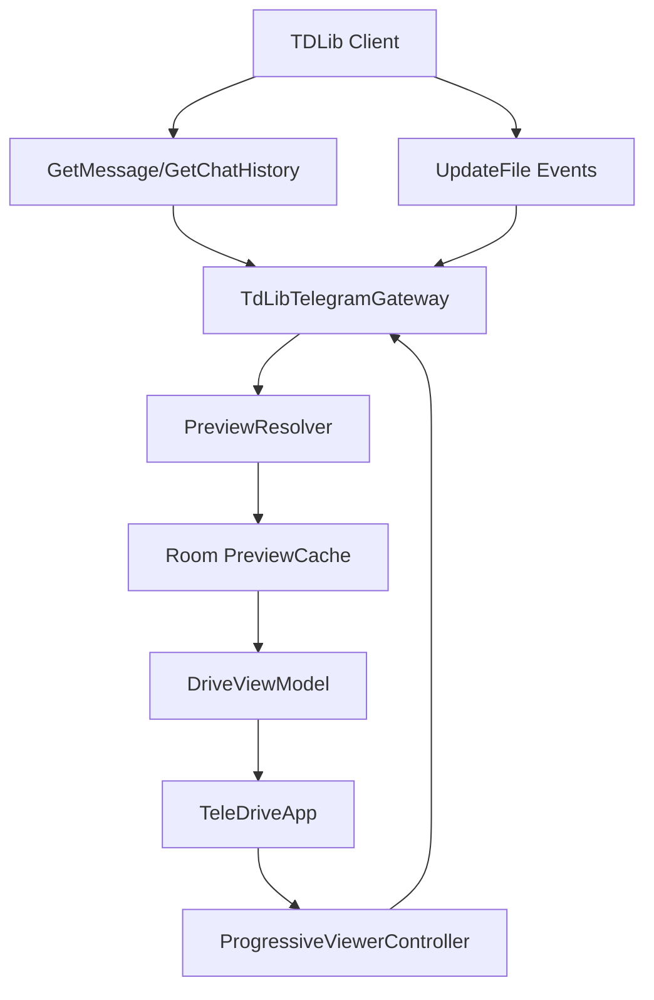

# TDLib Thumbnail + Progressive Viewer Implementation Plan

## Final Goal

Deliver a stable in-app file experience where:

- list rendering feels instant using cached previews,
- thumbnails and generated previews persist across app restarts,
- supported viewers open progressively from partial downloads,
- file fidelity and naming remain correct,
- and TDLib live file state (`UpdateFile`) is the single source of truth for progress and path changes.

## Codebase Understanding (Current Working)

### 1) Runtime wiring and boundaries

- `MainActivity` creates `AppContainer` and wires `AuthViewModel` + `DriveViewModel` into `TeleDriveApp`.  
  Path: [h:\code\drive\TeleDrive\app\src\main\java\com\teledrive\android\MainActivity.kt](h:\code\drive\TeleDrive\app\src\main\java\com\teledrive\android\MainActivity.kt)
- `AppContainer` builds Room + SecureSettings + BackupManager and chooses `TdLibTelegramGateway` or fallback gateway.  
  Path: [h:\code\drive\TeleDrive\app\src\main\java\com\teledrive\android\TeleDriveApplication.kt](h:\code\drive\TeleDrive\app\src\main\java\com\teledrive\android\TeleDriveApplication.kt)
- Telegram logic is correctly isolated behind `TelegramGateway`.  
  Path: [h:\code\drive\TeleDrive\app\src\main\java\com\teledrive\android\telegram\TelegramGateway.kt](h:\code\drive\TeleDrive\app\src\main\java\com\teledrive\android\telegram\TelegramGateway.kt)

### 2) Existing file flow

- `DriveViewModel` refreshes folders/files and orchestrates transfer records in Room.  
  Path: [h:\code\drive\TeleDrive\app\src\main\java\com\teledrive\android\ui\drive\DriveViewModel.kt](h:\code\drive\TeleDrive\app\src\main\java\com\teledrive\android\ui\drive\DriveViewModel.kt)
- `TdLibTelegramGateway` handles list/search/upload/download via reflection-based TDLib calls.  
  Path: [h:\code\drive\TeleDrive\app\src\main\java\com\teledrive\android\telegram\TdLibTelegramGateway.kt](h:\code\drive\TeleDrive\app\src\main\java\com\teledrive\android\telegram\TdLibTelegramGateway.kt)
- Compose list and preview are in `TeleDriveApp.kt`, where thumbnail decode/text reads currently happen inside item render paths.  
  Path: [h:\code\drive\TeleDrive\app\src\main\java\com\teledrive\android\ui\TeleDriveApp.kt](h:\code\drive\TeleDrive\app\src\main\java\com\teledrive\android\ui\TeleDriveApp.kt)

### 3) Key gaps to solve

- `UpdateFile` is not handled yet (only auth/connection updates are handled).
- Search/list scale is limited (`GetChatHistory` fixed limit and broad client-side search scan).
- Heavy preview work in composables causes jank.
- Transfer progress writes can churn Room/UI updates.
- DB uses destructive migration fallback; preview schema changes need safer migration path.

## Target Architecture

## One-Go Implementation Strategy (Error-Minimized)

### Phase 0: Safety guards before feature code

- Add feature flags (preview cache enable, progressive viewer enable) default ON for debug, controllable for fallback.
- Keep existing download/open path intact behind fallback switch.
- Add structured logs around TDLib update parsing and viewer threshold decisions.

### Phase 1: Add preview persistence model

- Update Room schema in:
  - [h:\code\drive\TeleDrive\app\src\main\java\com\teledrive\android\data\Entities.kt](h:\code\drive\TeleDrive\app\src\main\java\com\teledrive\android\data\Entities.kt)
  - [h:\code\drive\TeleDrive\app\src\main\java\com\teledrive\android\data\TeleDriveDao.kt](h:\code\drive\TeleDrive\app\src\main\java\com\teledrive\android\data\TeleDriveDao.kt)
  - [h:\code\drive\TeleDrive\app\src\main\java\com\teledrive\android\data\TeleDriveDatabase.kt](h:\code\drive\TeleDrive\app\src\main\java\com\teledrive\android\data\TeleDriveDatabase.kt)
- Add `PreviewCacheEntity` + DAO methods (`upsert`, `getByKey`, `deleteByKey`, `pruneOlderThan`).
- Add index support for file list queries.
- Add migration step instead of depending only on destructive fallback.

### Phase 2: TDLib `UpdateFile` pipeline

- Extend `handleUpdate` in:
  - [h:\code\drive\TeleDrive\app\src\main\java\com\teledrive\android\telegram\TdLibTelegramGateway.kt](h:\code\drive\TeleDrive\app\src\main\java\com\teledrive\android\telegram\TdLibTelegramGateway.kt)
- Parse and route `UpdateFile` events into internal observable state keyed by `fileId`.
- Expose helper flows/functions:
  - observe file state (`path`, `downloadedSize`, `size`, `isCompleted`)
  - await threshold bytes
  - await completion
- Keep polling fallback for compatibility if updates are missing.

### Phase 3: Cache-first preview resolver

- Add preview extraction logic in gateway mapping (`messageToFile` + media extraction).
- Resolve preview in this order:
  1. Room cache valid path/snippet
  2. TDLib thumbnail local complete path
  3. Trigger thumbnail tiny download and wait via `UpdateFile`
  4. Generate extension badge fallback
  5. For text/code only: partial download (2KB), safe decode, snippet persist
- Persist resolved preview result immediately.

### Phase 4: Progressive in-app open

- Update view/open behavior in:
  - [h:\code\drive\TeleDrive\app\src\main\java\com\teledrive\android\ui\TeleDriveApp.kt](h:\code\drive\TeleDrive\app\src\main\java\com\teledrive\android\ui\TeleDriveApp.kt)
  - [h:\code\drive\TeleDrive\app\src\main\java\com\teledrive\android\ui\drive\DriveViewModel.kt](h:\code\drive\TeleDrive\app\src\main\java\com\teledrive\android\ui\drive\DriveViewModel.kt)
- Threshold policy:
  - video: 8MB
  - PDF: 150KB
  - audio: 5MB
  - archive/office zip-based: full download
- Always use live `local.path` from latest `UpdateFile`, not stale message snapshot path.
- Seek-beyond-buffer handling: pause/show loading until `downloadedSize` catches up.

### Phase 5: UI hot path optimization

- Remove inline heavy decode/read from list composables.
- Bind list rows to preview-cache-backed lightweight model.
- Throttle transfer DB writes to reduce recomposition churn.
- Keep cache pruning integrated with existing policy:
  - [h:\code\drive\TeleDrive\app\src\main\java\com\teledrive\android\preview\CachePolicy.kt](h:\code\drive\TeleDrive\app\src\main\java\com\teledrive\android\preview\CachePolicy.kt)

### Phase 6: Test and rollout validation

- Unit tests:
  - cache-key derivation and collision resistance
  - threshold gating decisions
  - snippet binary/text detection
  - `UpdateFile` path-change handling
- Integration tests:
  - preview cache hit on cold app restart
  - progressive open state transitions
  - fallback to full download path
- Manual checklist:
  - large video seek forward/back
  - PDF first page open before completion
  - text snippet correctness
  - docx/xlsx full-download behavior
  - missing thumbnail fallback visuals

## Suggested Data Model Additions

- `PreviewCacheEntity`
  - `cacheKey: String` (PK, prefer `remote.uniqueId` else fallback composite key)
  - `fileId: Int?` (runtime file update binding)
  - `remoteUniqueId: String?` (cross-session stable identity)
  - `thumbnailLocalPath: String?`
  - `thumbnailReady: Boolean`
  - `previewKind: String` (`thumbnail`, `badge`, `text_snippet`, `mixed`)
  - `badgeExt: String?`
  - `badgeColor: Int?`
  - `textSnippet: String?`
  - `snippetBytes: Int?`
  - `mimeType: String?`
  - `sourceFileName: String?`
  - `updatedAt: Long`

- Optional `FileEntity` additions
  - `tdFileId: Int?`
  - `tdRemoteUniqueId: String?`
  - `previewCacheKey: String?`

## Risks And Mitigations

- TDLib reflection/schema variance: field-access wrappers + optional fallbacks + compatibility logs.
- Stale path risk: use latest `UpdateFile.file.local.path` before open and on completion.
- Partial text decode corruption: UTF-8 safe decode with replacement and binary guard heuristic.
- DB migration failures: explicit migration tests + fallback feature flags.
- UI jank from update floods: throttle transfer persistence and minimize recomposition payload.

## Definition Of Done

- File list scroll remains smooth with cached previews on second load.
- Uncached items progressively gain previews without blocking the list.
- Video/PDF/audio open at configured thresholds and recover from seek beyond buffer.
- Zip/docx/xlsx only open after completion with correct progress feedback.
- `UpdateFile` live path changes are used at open time and completion time.
- Restart shows preview cache reuse without recomputing all items.
- Existing upload/download/delete/move flows remain functional.
